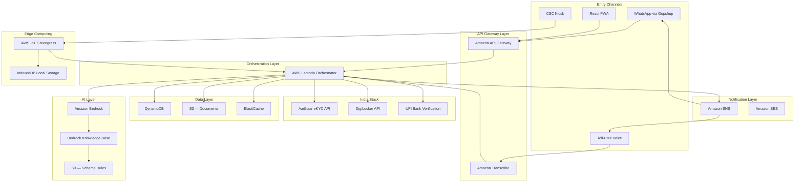

<div align="center">

# 🏛️ HaqDaari — _Your Rights, Delivered_

### AI-Powered Autonomous Agent for Government Welfare Scheme Discovery & Application

**₹2.68 Lakh Crore** in welfare benefits go unclaimed every year in India.<br/>
**HaqDaari** ensures no eligible citizen is left behind.

[](https://aws.amazon.com)
[](https://aws.amazon.com/bedrock/)
[](https://indiastack.org/)
[](https://kiro.dev)
[](LICENSE)

**Team Synapses** · AWS AI for Bharat Hackathon 2025

---

</div>

## The Problem

> **40–60% of eligible Indian citizens never claim their welfare benefits.**

India has **750+ government welfare schemes** across central and state levels — yet citizens miss out due to:

| Barrier | Impact |
|---------|--------|
|  **Awareness Gap** | Citizens don't know which schemes exist for them |
|  **Complex Forms** | Multi-page applications in English intimidate rural users |
|  **Language Barriers** | 500M+ Hindi speakers can't navigate English portals |
|  **Digital Illiteracy** | 65% of rural India has limited smartphone proficiency |
|  **CSC Bottlenecks** | 500,000+ CSCs lack tools for efficient citizen assistance |

**Result:** ₹2.68 lakh crore of welfare benefits go unclaimed annually — money that could transform lives.

---

## The Solution

**HaqDaari** is an AI-powered autonomous agent that acts as a **personal welfare assistant** for every Indian citizen. One Aadhaar number. Zero forms. Full transparency.

```
Citizen provides Aadhaar → AI fetches profile → Matches 750+ schemes → Auto-fills forms → Submits applications
                                    ↑                                           ↑
                              India Stack APIs                          Shadow Mode Preview
                          (Aadhaar eKYC + DigiLocker)              (Citizen approves every action)
```

---

## Five Core Features

### 1️⃣ Zero-Touch Eligibility Engine
> _"Just give your Aadhaar — we find every scheme you deserve."

- Pulls demographics via **Aadhaar eKYC** (name, age, gender, address)
- Fetches documents via **DigiLocker** (income, caste, land records)
- Matches against **750+ scheme rules** using **Amazon Bedrock RAG**
- Returns all eligible schemes in **< 30 seconds**

### 2️⃣ Scheme Arbitrage Detector
> _"Already getting ₹500/month? You qualify for ₹2,000/month instead."

- Compares current enrollments against all eligible alternatives
- Calculates benefit differences in monetary terms
- Proactively notifies citizens when better schemes exist (threshold: ₹100+/month)
- One-click scheme switch initiation

### 3️⃣ Shadow Mode — Transparent AI
> _"Here's exactly what I'll do. You approve. Then I act."

- Every AI action previewed in **simple Hindi** before execution
- Citizens can approve , modify , or cancel 
- Full audit trail: every action logged with timestamp + approval status
- Post-action feedback: see what was done, reverse within 24 hours

### 4️⃣ CSC Co-Pilot (Offline-First)
> _"No internet? No problem. The kiosk works offline."

- **Voice-powered**: Operator speaks with citizen → AI transcribes → auto-fills forms
- Runs on **AWS IoT Greengrass** at CSC edge devices
- **IndexedDB** local storage — works without connectivity
- Auto-syncs to cloud when back online (zero data loss)

### 5️⃣ WhatsApp + PWA Multi-Channel Access
> _"Works on a ₹3,000 phone over 2G."

- **WhatsApp**: Text & voice notes via Gupshup API (< 1000 chars for 2G)
- **Voice Calls**: Toll-free number → Amazon Transcribe + Polly (Hindi STT/TTS)
- **React PWA**: Shadow Mode dashboard, form review, offline-capable
- **CSC Kiosk**: Electron wrapper for operator-assisted flow

---

##  Architecture



---

##  Tech Stack

| Layer | Technology | Purpose |
|-------|-----------|---------|
| **Compute** | AWS Lambda (Node.js 18.x) | Serverless orchestration — auto-scales to 1 crore users |
| **AI/ML** | Amazon Bedrock + Knowledge Base | RAG-based eligibility matching across 750+ schemes |
| **Embeddings** | Amazon Titan Embeddings G1 | Vector embeddings for scheme rule retrieval |
| **Vector Store** | Amazon OpenSearch Serverless | Semantic search over scheme eligibility rules |
| **Speech** | Amazon Transcribe + Polly | Hindi STT/TTS for voice channels |
| **Database** | Amazon DynamoDB | Citizen profiles, sessions, applications (on-demand) |
| **Storage** | Amazon S3 (SSE-KMS) | Scheme rules, documents, application PDFs |
| **Cache** | Amazon ElastiCache (Redis) | Hot scheme rules, profile cache, eligibility results |
| **API** | Amazon API Gateway | REST APIs with throttling + caching |
| **Edge** | AWS IoT Greengrass v2 | Offline CSC operation with local AI |
| **Notifications** | Amazon SNS + SES | SMS, email, WhatsApp alerts |
| **Messaging** | Gupshup WhatsApp Business API | Primary citizen channel (1B+ Indian users) |
| **Monitoring** | CloudWatch + X-Ray | Metrics, alarms, distributed tracing |
| **Security** | AWS KMS + WAF + IAM | Encryption, DDoS protection, least-privilege access |
| **India Stack** | Aadhaar eKYC + DigiLocker + UPI | Government API integration for citizen verification |
| **Offline STT** | Vosk (Open Source) | Local Hindi speech recognition at CSCs |
| **Frontend** | React 18 + TypeScript + Tailwind | PWA with Service Workers for offline support |
| **Spec Tool** | Kiro | Requirements & design specification generation |

---

##  Cost Architecture

> **Target: < ₹1 per citizen per month at 1 crore users**

| Service | Cost/User/Month |
|---------|----------------|
| Lambda | ₹0.20 |
| DynamoDB | ₹0.15 |
| S3 | ₹0.05 |
| Bedrock | ₹0.30 |
| SNS (SMS) | ₹0.20 |
| Data Transfer | ₹0.10 |
| **Total** | **₹1.00** |

**MVP Phase**: All AWS services covered under hackathon credits. Out-of-pocket: ₹3,067–₹5,067/month (Gupshup API + domain only).

---

##  Security & Compliance

| Requirement | Implementation |
|-------------|---------------|
| **Aadhaar Protection** | AES-256 encryption at rest, SHA-256 hashing, last-4-digits masking |
| **Consent Management** | Explicit OTP-based consent with timestamp, purpose, expiry tracking |
| **Data Privacy** | Digital Personal Data Protection Act 2023 compliant |
| **Aadhaar Act** | Full Aadhaar Act 2016 compliance — no full numbers in logs |
| **Right to Deletion** | 48-hour SLA for complete data purge on citizen request |
| **Transport Security** | HTTPS/TLS 1.2+ for all API communications |
| **Access Control** | IAM least-privilege roles, RBAC for CSC operators, MFA for admins |
| **Network Protection** | API Gateway throttling + WAF rules + VPC isolation |
| **Audit Trail** | Every data access event logged with timestamp + user + action |

---

##  Repository Structure

```
Synapses-aws-aiforbharat/
├── README.md            ← You are here
├── requirements.md      ← Kiro-generated requirements specification
│                          15 requirements · 75+ acceptance criteria
│                          WHEN/SHALL/IF-THEN formal syntax
├── design.md            ← Kiro-generated design specification
│                          System architecture · Component interfaces
│                          Data models · 46 correctness properties
│                          Error handling · Testing strategy
│                          Deployment architecture
└── LICENSE              ← MIT License
```

---

##  Specification Artifacts (Generated with Kiro)

### [`requirements.md`](requirements.md)
- **15 functional requirements** with formal acceptance criteria
- Covers all 5 core features + scalability, security, language, error handling, analytics, MVP phasing
- Uses **WHEN/SHALL/IF-THEN** syntax for machine-verifiable specifications
- **75+ acceptance criteria** — every edge case documented

### [`design.md`](design.md)
- **Full system architecture** with Mermaid diagram (renders on GitHub)
- **7 component interfaces** with request/response contracts
- **6 TypeScript data models** (CitizenProfile, SchemeRule, Session, Application, etc.)
- **46 correctness properties** with full traceability to requirements
- **Error handling**: retry logic, circuit breakers, 4 graceful degradation scenarios
- **Testing strategy**: unit, property-based (fast-check), integration, performance, security, E2E
- **Deployment architecture**: Lambda config, DynamoDB, S3, Bedrock, Greengrass, monitoring, cost

---

## Impact Potential

| Metric | Value |
|--------|-------|
| 🇮🇳 **Addressable Population** | 80 crore citizens eligible for welfare schemes |
|  **Unclaimed Benefits** | ₹2.68 lakh crore annually |
|  **CSC Network** | 500,000+ Common Service Centers nationwide |
|  **WhatsApp Reach** | 500M+ Indian users — largest messaging platform |
|  **Hindi Speakers** | 600M+ native speakers served in their language |
|  **2G Compatibility** | Works on basic phones with minimal data |

---

##  Team Synapses

Built for the **AWS AI for Bharat Hackathon 2025** — solving India's largest welfare delivery gap with serverless AI, India Stack integration, and radical accessibility.

---

<div align="center">

**HaqDaari** — _Because every Indian deserves their हक़ (right)._  
_Spec'd with [Kiro](https://kiro.dev) · Built on [AWS](https://aws.amazon.com) · Powered by [India Stack](https://indiastack.org/)_

</div>
