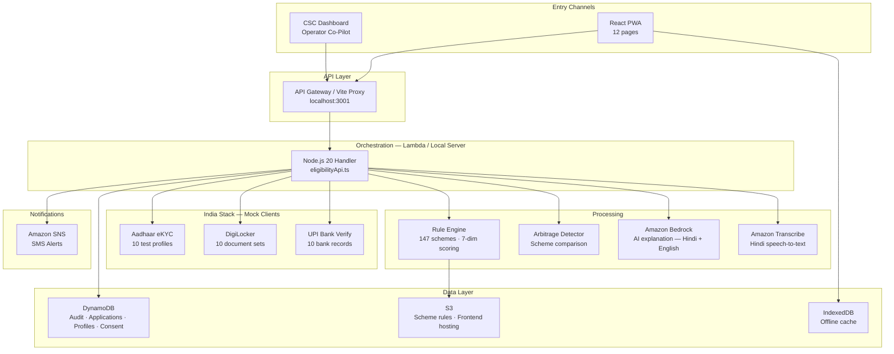

<div align="center">

# HaqDaari — _Your Rights, Delivered_

### AI-Powered Government Welfare Scheme Discovery & Eligibility Engine

**2.68 Lakh Crore** in welfare benefits go unclaimed every year in India.
**HaqDaari** ensures no eligible citizen is left behind.

[](https://aws.amazon.com)
[](https://aws.amazon.com/bedrock/)
[](https://indiastack.org/)
[](https://kiro.dev)

**Team Synapses** · AWS AI for Bharat Hackathon 2025

---

</div>

## The Problem

> **40-60% of eligible Indian citizens never claim their welfare benefits.**

India has **750+ government welfare schemes** across central and state levels — yet citizens miss out due to:

| Barrier | Impact |
|---------|--------|
| **Awareness Gap** | Citizens don't know which schemes exist for them |
| **Complex Forms** | Multi-page applications in English intimidate rural users |
| **Language Barriers** | 500M+ Hindi speakers can't navigate English portals |
| **Digital Illiteracy** | 65% of rural India has limited smartphone proficiency |
| **CSC Bottlenecks** | 500,000+ CSCs lack tools for efficient citizen assistance |

**Result:** 2.68 lakh crore of welfare benefits go unclaimed annually — money that could transform lives.

---

## The Solution

**HaqDaari** ("Your Right") is a full-stack application that acts as a **personal welfare assistant** for every Indian citizen. One Aadhaar number. Zero forms. Full transparency.

A citizen (or CSC operator) enters a **12-digit Aadhaar number**. The system then:

1. **Fetches demographics** from Aadhaar eKYC (name, age, gender, occupation, state)
2. **Fetches documents** from DigiLocker (income certificate, caste certificate, land records)
3. **Verifies bank account** via UPI/India Stack
4. **Matches against 147 verified government schemes** using a deterministic rule engine (7-dimensional scoring: age, income, gender, caste, occupation, state, land ownership)
5. **Detects Scheme Arbitrage** — identifies better schemes the citizen isn't enrolled in
6. **Generates AI explanation** via Amazon Bedrock (Hindi + English)
7. **Shows Shadow Mode preview** — citizen sees what _would_ happen before consenting
8. **Sends SMS notification** via Amazon SNS with results summary

All of this happens in **< 2 seconds**, fully automated.

---

## Five Core Features

### 1. Zero-Touch Eligibility Engine
> _"Just give your Aadhaar — we find every scheme you deserve."_

- Pulls demographics via **Aadhaar eKYC** (name, age, gender, address)
- Fetches documents via **DigiLocker** (income, caste, land records)
- Matches against **147 verified scheme rules** using a **deterministic rule engine** with 7-dimensional scoring
- Returns all eligible schemes in **< 2 seconds**

### 2. Scheme Arbitrage Detector
> _"Already getting 500/month? You qualify for 2,000/month instead."_

- Compares current enrollments against all eligible alternatives
- Calculates benefit differences in monetary terms
- Proactively identifies when better schemes exist
- One-click scheme switch initiation

### 3. Shadow Mode — Transparent AI
> _"Here's exactly what I'll do. You approve. Then I act."_

- Every AI action previewed in **simple Hindi** before execution
- Citizens can approve, modify, or cancel
- Full audit trail: every action logged with timestamp + approval status
- Bilingual preview (Hindi + English)

### 4. CSC Co-Pilot (Offline-First)
> _"No internet? No problem. The kiosk works offline."_

- **3-column dashboard**: API log · citizen profile · auto-filled form
- **IndexedDB** local storage — works without connectivity
- Auto-syncs queued applications when back online (zero data loss)
- Operators can "Apply All" with one click

### 5. Bilingual PWA
> _"Works on a 3,000 phone."_

- **React PWA** with service workers for offline caching
- Every screen shows both **Hindi** and **English** text
- WhatsApp-style chat demo for conversational interaction
- Bottom nav with quick access to all features

---

## Architecture


```mermaid
graph TB
    subgraph "Entry Channels"
        PWA[React PWA<br/>12 pages]
        CSC[CSC Dashboard<br/>Operator Co-Pilot]
    end

    subgraph "API Layer"
        APIGW[API Gateway / Vite Proxy<br/>localhost:3001]
    end

    subgraph "Orchestration — Lambda / Local Server"
        Lambda[Node.js 20 Handler<br/>eligibilityApi.ts]
    end

    subgraph "India Stack — Mock Clients"
        Aadhaar[Aadhaar eKYC<br/>10 test profiles]
        DL[DigiLocker<br/>10 document sets]
        UPI[UPI Bank Verify<br/>10 bank records]
    end

    subgraph "Processing"
        Rules[Rule Engine<br/>147 schemes · 7-dim scoring]
        Arbitrage[Arbitrage Detector<br/>Scheme comparison]
        Bedrock[Amazon Bedrock<br/>AI explanation — Hindi + English]
        Transcribe[Amazon Transcribe<br/>Hindi speech-to-text]
    end

    subgraph "Data Layer"
        DDB[DynamoDB<br/>Audit · Applications · Profiles · Consent]
        S3[S3<br/>Scheme rules · Frontend hosting]
        IndexedDB[IndexedDB<br/>Offline cache]
    end

    subgraph "Notifications"
        SNS[Amazon SNS<br/>SMS Alerts]
    end

    PWA --> APIGW
    CSC --> APIGW

    APIGW --> Lambda

    Lambda --> Aadhaar
    Lambda --> DL
    Lambda --> UPI
    Lambda --> Rules
    Lambda --> Arbitrage
    Lambda --> Bedrock
    Lambda --> Transcribe
    Lambda --> DDB
    Lambda --> SNS

    Rules --> S3
    PWA --> IndexedDB
```

### Why Rule Engine, Not RAG?

For 147 government schemes with structured eligibility criteria (`income < 5L`, `age > 18`, `state = Bihar`), a **rule engine is 100% accurate and costs $0**. RAG/Vector search is fuzzy — it would be _less_ accurate for deterministic eligibility matching, and costs ~$350/month (OpenSearch Serverless).

We use **Bedrock only for NLP tasks** where AI adds genuine value:

- Natural language explanation of eligibility results (Hindi + English)
- AI-powered form filling
- Voice transcription (Hindi → text)
- Knowledge base Q&A

---

## Scheme Data Sources

All 147 schemes are **real government programs** with verifiable source URLs:

| Category           | Count | Source                                                                 |
| ------------------ | ----- | ---------------------------------------------------------------------- |
| Central Government | 96    | [myscheme.gov.in](https://www.myscheme.gov.in), Ministry websites, PIB |
| Uttar Pradesh      | 6     | mksy.up.gov.in, sspy-up.gov.in                                         |
| Bihar              | 5     | sspmis.bihar.gov.in, medhasoft.bih.nic.in                              |
| Madhya Pradesh     | 5     | ladlilaxmi.mp.gov.in, sambal.mp.gov.in                                 |
| Tamil Nadu         | 5     | tnsocialwelfare.tn.gov.in, fisheries.tn.gov.in                         |
| Rajasthan          | 5     | chiranjeevi.rajasthan.gov.in, sje.rajasthan.gov.in                     |
| Kerala             | 5     | welfarepension.lsgkerala.gov.in, kasp.kerala.gov.in                    |
| Odisha             | 5     | kalia.odisha.gov.in, subhadra.odisha.gov.in                            |
| Maharashtra        | 5     | jeevandayee.gov.in, ladakibahin.maharashtra.gov.in                     |
| Gujarat            | 5     | sje.gujarat.gov.in, gujaratindia.gov.in                                |
| Jharkhand          | 5     | jrfry.jharkhand.gov.in, ekalyan.cgg.gov.in                             |

> **Note**: Scheme names are verified real programs (PM-KISAN, PMJAY, KALIA, Chiranjeevi, Ladki Bahin, etc.). Specific benefit amounts and eligibility criteria are approximate and sourced from publicly available information as of 2024-25. For production, integrate with [MyScheme.gov.in API](https://www.myscheme.gov.in) (requires government partnership for auth).

---

## Tech Stack

| Layer | Technology | Purpose |
|-------|-----------|---------|
| **Frontend** | React 18, TypeScript, Vite 6, Tailwind 3, Framer Motion | PWA with service workers for offline support |
| **State** | Zustand | Minimal, fast, no boilerplate |
| **Offline** | IndexedDB | CSC kiosks may lose connectivity |
| **Backend** | Node.js 20, TypeScript, AWS SDK v3 | Lambda-compatible, type-safe |
| **API** | HTTP API Gateway (v2) | Low-latency, cost-effective |
| **Database** | DynamoDB (PAY_PER_REQUEST) | Zero idle cost, auto-scaling |
| **AI/ML** | Amazon Bedrock (Titan/Claude) | Hindi NLP, form fill, explanation |
| **Voice** | Amazon Transcribe | Hindi speech-to-text |
| **Notifications** | Amazon SNS | SMS delivery |
| **IaC** | Terraform | Reproducible, version-controlled |
| **Monitoring** | CloudWatch (logs + alarms) | Error tracking, latency metrics |
| **Cost Control** | AWS Budgets ($50 alarm) | Prevent bill shock |
| **India Stack** | Aadhaar eKYC + DigiLocker + UPI | Citizen verification (mock for demo) |
| **Spec Tool** | [Kiro](https://kiro.dev) | Requirements & design specification |

---

## Project Structure

```
project_files/
├── backend/                    # Node.js + TypeScript backend
│   ├── package.json
│   ├── tsconfig.json
│   └── src/
│       ├── local-server.ts     # Express-less HTTP dev server (port 3001)
│       ├── handlers/
│       │   └── eligibilityApi.ts   # Lambda handler — full pipeline
│       ├── clients/
│       │   ├── aadhaarClient.ts    # Mock Aadhaar eKYC (10 profiles)
│       │   ├── bedrockClient.ts    # Mock Bedrock AI (5 functions)
│       │   ├── digilockerClient.ts # Mock DigiLocker (10 doc sets)
│       │   ├── dynamoClient.ts     # DynamoDB + in-memory fallback
│       │   ├── snsClient.ts        # Mock SNS SMS
│       │   ├── transcribeClient.ts # Mock Transcribe (Hindi STT)
│       │   └── upiBankClient.ts    # Mock UPI bank verify
│       └── services/
│           ├── eligibilityService.ts   # Rule-based matching (7 dimensions)
│           └── arbitrageService.ts     # Scheme arbitrage detection
│
├── frontend/                   # React 18 + Vite 6 + Tailwind 3
│   ├── package.json
│   ├── vite.config.ts          # API proxy to localhost:3001
│   ├── tailwind.config.js
│   └── src/
│       ├── App.tsx             # Router (12 pages)
│       ├── api.ts              # Fetch wrappers
│       ├── store.ts            # Zustand global state
│       ├── offlineDb.ts        # IndexedDB for offline CSC kiosks
│       ├── components/
│       │   ├── Layout.tsx      # Bottom nav + Outlet
│       │   ├── SchemeCard.tsx   # Reusable scheme card
│       │   └── ShadowModal.tsx # Shadow Mode consent overlay
│       └── pages/
│           ├── Home.tsx            # Dashboard
│           ├── Onboarding.tsx      # 3-slide intro
│           ├── EligibilityCheck.tsx # Aadhaar input + shadow flow
│           ├── Results.tsx         # Matched schemes list
│           ├── SchemeComparison.tsx # Side-by-side comparison
│           ├── SchemeArbitrage.tsx  # Arbitrage opportunities
│           ├── ApplicationForm.tsx # Auto-filled form
│           ├── Tracking.tsx        # Application status
│           ├── Notifications.tsx   # Notifications
│           ├── Profile.tsx         # User profile
│           ├── CscDashboard.tsx    # CSC operator co-pilot
│           └── WhatsAppDemo.tsx    # WhatsApp chat demo
│
├── shared/                     # TypeScript types shared across packages
│   └── types/
│       ├── index.ts            # Barrel export
│       ├── CitizenProfile.ts
│       ├── EligibilityResult.ts
│       ├── SchemeRule.ts
│       └── ShadowPreview.ts
│
├── data/                       # Scheme data generator + output
│   ├── generate-schemes.js     # Generates all-schemes.json
│   └── schemes/
│       └── all-schemes.json    # 147 verified scheme definitions
│
├── infra/                      # Terraform IaC
│   ├── main.tf                 # Provider config (ap-south-1)
│   ├── resources.tf            # Lambda, API GW, DDB, S3, SNS, IAM
│   └── outputs.tf              # Deployment outputs
│
├── SETUP_AND_DEPLOY.md         # Detailed setup + deployment guide
└── README.md                   # This file
```

---

## Quick Start (Local Development)

### Prerequisites

| Tool    | Version                 | Check            |
| ------- | ----------------------- | ---------------- |
| Node.js | >= 18 (tested on 20.x) | `node --version` |
| npm     | >= 9                    | `npm --version`  |

No AWS account needed for local development.

### Step 1: Clone and Install

```bash
git clone <repo-url>
cd HaqDaari-gh/project_files
npm install
```

This installs all three workspaces (`backend`, `frontend`, `shared`) via npm workspaces.

### Step 2: Start the Backend

```bash
# From project_files/ root:
npm run backend:dev
```

You should see:

```
[HaqDaari Backend] Local dev server running on http://localhost:3001
[HaqDaari Backend] Endpoints:
  POST /api/eligibility      — Zero-Touch Eligibility Engine
  POST /api/applications      — Submit application
  GET  /api/applications      — List applications
  POST /api/transcribe        — Amazon Transcribe (Hindi STT)
  POST /api/form-fill         — Bedrock Auto Form Filler
  POST /api/knowledge-base    — Bedrock Knowledge Base (RAG)
  GET  /api/audit             — Audit trail
```

> **Troubleshooting — Port 3001 in use:**
>
> - Windows: `Get-NetTCPConnection -LocalPort 3001 | ForEach-Object { Stop-Process -Id $_.OwningProcess -Force }`
> - Linux/Mac: `lsof -ti:3001 | xargs kill -9`

### Step 3: Start the Frontend

```bash
# In a new terminal:
cd project_files/frontend
npm run dev
```

Opens at `http://localhost:5173`. The Vite dev server auto-proxies `/api/*` → `localhost:3001`.

### Step 4: Test It

1. Open `http://localhost:5173` in your browser
2. Open `http://localhost:5173/onboarding` to go through the **Onboarding** slides (optional)
3. Navigate to **CSC Dashboard** (Home page → quick actions → "CSC Co-Pilot")
4. Enter an Aadhaar number from the test profiles below
5. See real-time eligibility results

### Test Profiles

| Aadhaar            | Name              | Occupation    | Income | State          | Expected Schemes |
| ------------------ | ----------------- | ------------- | ------ | -------------- | ---------------- |
| `111122223333`     | Sunita Devi       | daily_wage    | 48K   | Bihar          | ~54              |
| `222233334444`     | Lakshmi Narayanan | fisherman     | 60K   | Tamil Nadu     | ~30              |
| `333344445555`     | Priya Sharma      | self_employed | 1.5L  | Rajasthan      | ~49              |
| `444455556666`     | Arjun Vishwakarma | artisan       | 96K   | Madhya Pradesh | ~38              |
| `555566667777`     | Biju Mohan        | farmer        | 84K   | Kerala         | ~47              |
| `666677778888`     | Meena Kumari      | weaver        | 36K   | Odisha         | ~52              |
| `777788889999`     | Rajendra Patil    | farmer        | 5L    | Maharashtra    | ~33              |
| `888899990000`     | Kavita Singh      | street_vendor | 1.2L  | Gujarat        | ~49              |
| `999900001111`     | Mahendra Oraon    | farmer        | 10L   | Jharkhand      | ~31              |
| Any other 12-digit | Ramesh Kumar      | farmer        | 72K   | Uttar Pradesh  | ~49              |

> Different profiles get different scheme counts because the eligibility engine is **data-driven** — `profile.income <= scheme.incomeCeiling`. A 48K daily wage worker naturally qualifies for more BPL schemes than a 10L farmer.

### Step 5: Test the API Directly

```bash
# PowerShell
Invoke-RestMethod -Uri "http://localhost:3001/api/eligibility" -Method Post `
  -Body '{"aadhaarNumber":"111122223333"}' -ContentType "application/json" |
  ConvertTo-Json -Depth 5

# curl
curl -s -X POST http://localhost:3001/api/eligibility \
  -H "Content-Type: application/json" \
  -d '{"aadhaarNumber":"111122223333"}' | jq .
```

### API Reference

| Method | Endpoint                          | Body                                                   | Description               |
| ------ | --------------------------------- | ------------------------------------------------------ | ------------------------- |
| POST   | `/api/eligibility`                | `{"aadhaarNumber":"111122223333"}`                     | Full eligibility pipeline |
| POST   | `/api/applications`               | `{"citizenId":"...", "schemeId":"PM-KISAN", ...}`      | Submit application        |
| GET    | `/api/applications?citizenId=xxx` | —                                                      | List applications         |
| POST   | `/api/transcribe`                 | `{"audioContext":"default"}`                            | Hindi voice → text        |
| POST   | `/api/form-fill`                  | `{"citizenName":"Sunita Devi", "schemeId":"PM-KISAN"}` | AI form fill              |
| POST   | `/api/knowledge-base`             | `{"query":"..."}`                                      | Knowledge base Q&A        |
| GET    | `/api/audit`                      | —                                                      | All audit events          |

---

## Eligibility Engine — How It Works

The rule engine in `eligibilityService.ts` scores each citizen against each scheme on **7 dimensions**:

| Dimension  | Scheme Field             | Profile Field   | Logic                                    |
| ---------- | ------------------------ | --------------- | ---------------------------------------- |
| Age        | `ageMin`, `ageMax`       | `age`           | Range check                              |
| Income     | `incomeCeiling`          | `income`        | `profile.income <= scheme.incomeCeiling` |
| Gender     | `gender[]`               | `gender`        | Array membership                         |
| Caste      | `caste[]`                | `caste`         | Array membership (case-insensitive)      |
| Occupation | `occupation[]`           | `occupation`    | Array membership (case-insensitive)      |
| State      | `state[]`                | `address.state` | Array membership (state schemes only)    |
| Land       | `landOwnership{min,max}` | `landOwnership` | Range check                              |

A scheme is eligible if the citizen scores **>= 70%** across all applicable criteria. Criteria that aren't defined on a scheme are skipped (don't count toward the total).

---

## Frontend Pages

| Page              | Route              | Description                       |
| ----------------- | ------------------ | --------------------------------- |
| Onboarding        | `/onboarding`      | 3-slide intro explaining HaqDaari |
| Home              | `/`                | Dashboard with quick actions      |
| Eligibility Check | `/eligibility`     | Aadhaar input + Shadow Mode       |
| Results           | `/results`         | Matched schemes list              |
| Scheme Comparison | `/compare`         | Side-by-side top 3                |
| Scheme Arbitrage  | `/arbitrage`       | Better scheme opportunities       |
| Application Form  | `/apply/:schemeId` | Auto-filled application           |
| Tracking          | `/tracking`        | Application status timeline       |
| Notifications     | `/notifications`   | Notification list                 |
| Profile           | `/profile`         | User profile + settings           |
| CSC Dashboard     | `/csc`             | CSC operator 3-column view        |
| WhatsApp Demo     | `/whatsapp`        | Animated chat simulation          |

---

## AWS Cloud Deployment

### Prerequisites

| Tool        | Version                        |
| ----------- | ------------------------------ |
| AWS CLI v2  | `aws --version`                |
| Terraform   | >= 1.5 (`terraform --version`) |
| AWS Account | With admin access              |

### Step 1: Configure AWS CLI

```bash
aws configure
# AWS Access Key ID: <your-key>
# AWS Secret Access Key: <your-secret>
# Default region: ap-south-1
# Default output format: json
```

### Step 2: Deploy Infrastructure

```bash
cd project_files/infra

terraform init
terraform plan
terraform apply
```

This creates:

| Resource    | Name                           | Purpose           |
| ----------- | ------------------------------ | ----------------- |
| Lambda      | `haqdaari-demo-eligibility`    | Backend API       |
| API Gateway | `haqdaari-demo-api`            | HTTP endpoint     |
| DynamoDB    | `HaqDaariCitizenProfilesDemo`  | Citizen data      |
| DynamoDB    | `HaqDaariConsentRecordsDemo`   | Consent audit     |
| DynamoDB    | `HaqDaariApplicationsDemo`     | Applications      |
| DynamoDB    | `HaqDaariAuditTrailDemo`       | Audit trail       |
| S3          | `haqdaari-demo-scheme-rules`   | Scheme JSON       |
| S3          | `haqdaari-demo-frontend`       | PWA hosting       |
| SNS         | `haqdaari-demo-citizen-alerts` | SMS notifications |
| CloudWatch  | Logs + error alarms            | Monitoring        |
| Budget      | $50/month alarm                | Cost control      |

### Step 3: Build and Deploy Backend

```bash
cd project_files/backend

npx tsc

# Option A: Simple zip
cd dist && zip -r ../function.zip . && cd ..
zip -r function.zip node_modules/

# Option B: esbuild (recommended — smaller bundle)
npx esbuild src/handlers/eligibilityApi.ts --bundle --platform=node --target=node20 --outfile=dist/index.js
cd dist && zip ../function.zip index.js && cd ..

# Deploy
aws lambda update-function-code \
  --function-name haqdaari-demo-eligibility \
  --zip-file fileb://function.zip \
  --region ap-south-1
```

### Step 4: Upload Scheme Data + Frontend

```bash
BUCKET=$(cd ../infra && terraform output -raw scheme_rules_bucket)
aws s3 cp ../data/schemes/all-schemes.json s3://$BUCKET/all-schemes.json

cd ../frontend
echo "VITE_API_BASE=https://<api-gateway-url>" > .env.production
npm run build
FRONTEND_BUCKET=$(cd ../infra && terraform output -raw s3_frontend_bucket)
aws s3 sync dist/ s3://$FRONTEND_BUCKET/ --delete
```

### Step 5: Verify

```bash
cd infra && terraform output api_endpoint

curl -X POST https://<api-endpoint>/api/eligibility \
  -H "Content-Type: application/json" \
  -d '{"aadhaarNumber":"111122223333"}'
```

> See [SETUP_AND_DEPLOY.md](SETUP_AND_DEPLOY.md) for detailed step-by-step instructions including IAM user setup, CloudFront configuration, and teardown.

---

## Security & Compliance

| Requirement | Implementation |
|-------------|---------------|
| **Aadhaar Protection** | SHA-256 masking in logs — only last 4 digits displayed |
| **Consent Management** | Shadow Mode preview before any data access |
| **Data Privacy** | No Aadhaar numbers stored in plain text |
| **Transport Security** | HTTPS/TLS for all API communications |
| **Access Control** | IAM least-privilege roles for Lambda, S3, DynamoDB |
| **Network Protection** | API Gateway with CORS + S3 public access blocked |
| **Audit Trail** | Every eligibility check and application logged with timestamp |
| **Cost Protection** | AWS Budgets alarm at $50/month |

---

## What's Real vs. Mock

| Component           | Local (Demo)                                       | AWS (Production)                      |
| ------------------- | -------------------------------------------------- | ------------------------------------- |
| Aadhaar eKYC        | Mock — 10 hardcoded profiles                       | Real UIDAI API (requires partnership) |
| DigiLocker          | Mock — 10 document sets                            | Real DigiLocker OAuth API             |
| UPI Bank Verify     | Mock — 10 bank records                             | Real NPCI/bank API                    |
| Eligibility Engine  | **Real** — 147 verified schemes, 7-dim scoring     | Same                                  |
| Scheme Data         | **Real** — all from govt sources with source URLs  | Same + MyScheme.gov.in API            |
| Arbitrage Detection | **Real** — actual scheme comparison logic          | Same                                  |
| Bedrock AI          | Mock — template strings                            | Real Bedrock API (Titan/Claude)       |
| Amazon Transcribe   | Mock — 3 Hindi transcripts                         | Real Transcribe streaming API         |
| Amazon SNS          | Mock — console log                                 | Real SMS delivery                     |
| DynamoDB            | In-memory fallback                                 | Real DynamoDB tables                  |
| Frontend PWA        | **Real** — service worker, offline DB, Tailwind UI | Same + CloudFront CDN                 |

> **Key insight**: The eligibility engine and scheme data are production-ready. The mock clients (`aadhaarClient.ts`, `digilockerClient.ts`, etc.) are designed for drop-in replacement — each exports a single async function with the same interface as the real API would provide.

---

## Environment Variables

### Backend (Lambda / Local)

| Variable                 | Default                          | Description                      |
| ------------------------ | -------------------------------- | -------------------------------- |
| `PORT`                   | `3001`                           | Local server port                |
| `AWS_REGION`             | `ap-south-1`                     | AWS region                       |
| `DYNAMO_AUDIT_TABLE`     | _(empty = in-memory)_            | DynamoDB audit table name        |
| `DYNAMO_APP_TABLE`       | _(empty = in-memory)_            | DynamoDB applications table name |
| `SCHEME_RULES_BUCKET`    | —                                | S3 bucket for scheme JSON        |
| `SNS_TOPIC_ARN`          | —                                | SNS topic for SMS alerts         |
| `BEDROCK_MODEL_ID`       | `amazon.titan-text-premier-v2:0` | Bedrock model ID                 |
| `TRANSCRIBE_LANGUAGE`    | `hi-IN`                          | Transcribe language code         |
| `ENABLE_MOCK_AADHAAR`    | `true`                           | Use mock Aadhaar client          |
| `ENABLE_MOCK_DIGILOCKER` | `true`                           | Use mock DigiLocker client       |
| `ENABLE_MOCK_UPI_BANK`   | `true`                           | Use mock UPI client              |
| `MASK_AADHAAR_IN_LOGS`   | `true`                           | Mask Aadhaar in audit logs       |

### Frontend

| Variable        | Default                   | Description                 |
| --------------- | ------------------------- | --------------------------- |
| `VITE_API_BASE` | _(empty = relative /api)_ | API base URL for production |

---

## Cost Estimate (Demo)

| Resource                   | Monthly Cost       |
| -------------------------- | ------------------ |
| Lambda (1K requests/day)   | ~$0.00 (free tier) |
| API Gateway                | ~$0.00 (free tier) |
| DynamoDB (PAY_PER_REQUEST) | ~$0.00 (free tier) |
| S3 (schemes + frontend)    | ~$0.05             |
| CloudFront                 | ~$0.00 (free tier) |
| Bedrock (if enabled)       | ~$1-5/month        |
| SNS SMS (if enabled)       | ~$0.50/month       |
| **Total**                  | **~$1-6/month**    |

Compare: Full RAG with OpenSearch Serverless = **$350+/month** for the same functionality.

---

## Impact Potential

| Metric | Value |
|--------|-------|
| **Addressable Population** | 80 crore citizens eligible for welfare schemes |
| **Unclaimed Benefits** | 2.68 lakh crore annually |
| **CSC Network** | 500,000+ Common Service Centers nationwide |
| **WhatsApp Reach** | 500M+ Indian users — largest messaging platform |
| **Hindi Speakers** | 600M+ native speakers served in their language |

---

## Specification Artifacts (Generated with Kiro)

### [`requirements.md`](../supporting_files/requirements.md)
- **15 functional requirements** with formal acceptance criteria
- Uses **WHEN/SHALL/IF-THEN** syntax for machine-verifiable specifications
- **75+ acceptance criteria** — every edge case documented

### [`design.md`](../supporting_files/design.md)
- **Full system architecture** with component interfaces
- **6 TypeScript data models** (CitizenProfile, SchemeRule, Session, Application, etc.)
- **46 correctness properties** with full traceability to requirements
- Error handling, testing strategy, deployment architecture

---

## Regenerating Scheme Data

```bash
cd project_files/data
node generate-schemes.js
# → Generated 147 schemes (96 central + 51 state)
```

The output file `schemes/all-schemes.json` is imported directly by the backend.

---

## Known Limitations (Demo)

1. **Mock India Stack** — Aadhaar, DigiLocker, UPI are simulated with 10 hardcoded profiles. Production requires government API partnerships.
2. **No authentication** — No login/JWT/sessions. Production needs Aadhaar-based auth or CSC operator login.
3. **Some frontend pages are static** — Home, Profile, Tracking, Notifications show hardcoded data instead of reading from API state. The CSC Dashboard and EligibilityCheck pages are fully dynamic.
4. **Scheme amounts are approximate** — While all 147 scheme names are real verified government programs, the exact benefit amounts and eligibility criteria may vary from current official figures.
5. **No tests** — No unit, integration, or E2E tests included.
6. **Production features not yet implemented** — WhatsApp integration (Gupshup), voice calls (Polly), AWS IoT Greengrass edge computing, and ElastiCache are described in the design specification but not yet built. These are planned for post-hackathon.

---

<div align="center">

**HaqDaari** — _Because every Indian deserves their right._

_Spec'd with [Kiro](https://kiro.dev) · Built on [AWS](https://aws.amazon.com) · Powered by [India Stack](https://indiastack.org/)_

**Team Synapses** · AWS AI for Bharat Hackathon 2025

</div>
