# Design Document: HaqDaari

## Overview

HaqDaari is an AI-powered autonomous agent that helps Indian citizens discover and apply for government welfare schemes. The system architecture is designed for scale (1 crore users), cost efficiency (< Rs 1 per user per month), and accessibility (works on 2G networks, feature phones, and offline at CSCs).

The system follows a serverless, event-driven architecture using AWS services, integrates with India Stack APIs (Aadhaar eKYC, DigiLocker), and provides multiple access channels (WhatsApp, voice calls, PWA). The design emphasizes transparency through Shadow Mode, offline capability through AWS IoT Greengrass, and AI-powered eligibility matching using Amazon Bedrock.

## Architecture

### High-Level Architecture

```mermaid
graph TB
    subgraph Entry["Entry Channels"]
        WA[WhatsApp via Gupshup]:::entryNode
        Voice[Toll-Free Voice]:::entryNode
        PWA[React PWA]:::entryNode
        CSC[CSC Kiosk]:::entryNode
    end
    
    subgraph Gateway["API Gateway Layer"]
        APIGW[Amazon API Gateway]:::gatewayNode
        Transcribe[Amazon Transcribe STT]:::gatewayNode
        Polly[Amazon Polly TTS]:::gatewayNode
    end
    
    subgraph Orchestration["Orchestration Layer"]
        Lambda[AWS Lambda Orchestrator]:::orchestrationNode
    end
    
    subgraph AI["AI Layer"]
        Bedrock[Amazon Bedrock]:::aiNode
        KB[Bedrock Knowledge Base]:::aiNode
        S3Schemes[S3 Scheme Rules]:::storageNode
    end
    
    subgraph IndiaStack["India Stack APIs"]
        Aadhaar[Aadhaar eKYC]:::indiaStackNode
        DL[DigiLocker]:::indiaStackNode
        UPI[UPI Verification]:::indiaStackNode
    end
    
    subgraph Data["Data Layer"]
        DDB[DynamoDB]:::dataNode
        S3Data[S3 Documents]:::storageNode
        Cache[ElastiCache]:::dataNode
    end
    
    subgraph Notifications["Notification Layer"]
        SNS[Amazon SNS]:::notificationNode
        SES[Amazon SES]:::notificationNode
    end
    
    subgraph Edge["Edge Computing"]
        Greengrass[AWS IoT Greengrass]:::edgeNode
        IndexedDB[IndexedDB Storage]:::edgeNode
    end
    
    %% Entry to Gateway
    WA -->|Webhook| APIGW
    Voice -->|Audio Stream| Transcribe
    PWA -->|HTTPS| APIGW
    CSC -->|Local API| Greengrass
    
    %% Gateway to Orchestration
    APIGW -->|Events| Lambda
    Transcribe -->|Text| Lambda
    Greengrass -->|Sync| Lambda
    
    %% Orchestration to AI
    Lambda -->|Query| Bedrock
    Bedrock -->|RAG| KB
    KB -->|Retrieve| S3Schemes
    
    %% Orchestration to India Stack
    Lambda -->|eKYC| Aadhaar
    Lambda -->|Fetch Docs| DL
    Lambda -->|Verify Bank| UPI
    
    %% Orchestration to Data
    Lambda -->|Read/Write| DDB
    Lambda -->|Store/Fetch| S3Data
    Lambda -->|Cache| Cache
    
    %% Orchestration to Notifications
    Lambda -->|Send SMS| SNS
    Lambda -->|Send Email| SES
    Lambda -->|Generate Speech| Polly
    
    %% Notifications to Entry
    SNS -.->|SMS/WhatsApp| WA
    SES -.->|Email| WA
    Polly -.->|Audio| Voice
    
    %% Edge Computing
    Greengrass -->|Offline Store| IndexedDB
    
    classDef entryNode fill:#25D366,stroke:#128C7E,stroke-width:2px,color:#fff
    classDef gatewayNode fill:#FF9900,stroke:#FF6600,stroke-width:2px,color:#fff
    classDef orchestrationNode fill:#FF4F00,stroke:#CC3F00,stroke-width:3px,color:#fff
    classDef aiNode fill:#9B59B6,stroke:#8E44AD,stroke-width:2px,color:#fff
    classDef indiaStackNode fill:#FF9933,stroke:#138808,stroke-width:2px,color:#fff
    classDef dataNode fill:#3498DB,stroke:#2980B9,stroke-width:2px,color:#fff
    classDef storageNode fill:#1ABC9C,stroke:#16A085,stroke-width:2px,color:#fff
    classDef notificationNode fill:#E74C3C,stroke:#C0392B,stroke-width:2px,color:#fff
    classDef edgeNode fill:#34495E,stroke:#2C3E50,stroke-width:2px,color:#fff
```



### Component Architecture

The system is organized into the following major components:

1. **Entry Layer**: Multi-channel access (WhatsApp, Voice, PWA, CSC)
2. **API Gateway Layer**: Request routing and protocol translation
3. **Orchestration Layer**: Business logic and workflow management
4. **AI Layer**: Eligibility matching and form filling using Bedrock
5. **India Stack Integration**: Aadhaar, DigiLocker, UPI APIs
6. **Data Layer**: Profile storage, document storage, caching
7. **Notification Layer**: SMS, WhatsApp, Email alerts
8. **Edge Computing**: Offline CSC operation

## Components and Interfaces

### 1. Entry Channels

#### WhatsApp Interface
- **Technology**: Gupshup WhatsApp Business API
- **Capabilities**: Text messages, voice notes, document sharing
- **Protocol**: HTTPS webhooks
- **Message Format**: JSON with text, audio, or document payload
- **Rate Limits**: 1000 messages per second per business account

**Interface**:
```
Endpoint: POST /webhook/whatsapp
Request: {
  "from": "+91XXXXXXXXXX",
  "type": "text|audio|document",
  "content": "message text or media URL",
  "timestamp": "ISO-8601"
}
Response: {
  "status": "queued|sent|delivered|read",
  "messageId": "unique-id"
}
```

#### Voice Interface
- **Technology**: Amazon Connect + Amazon Transcribe + Amazon Polly
- **Capabilities**: Hindi speech-to-text, text-to-speech
- **Protocol**: SIP/PSTN
- **Languages**: Hindi, English

**Interface**:
```
Endpoint: POST /webhook/voice
Request: {
  "callId": "unique-call-id",
  "from": "+91XXXXXXXXXX",
  "audioStream": "base64-encoded-audio",
  "language": "hi-IN"
}
Response: {
  "transcript": "transcribed text",
  "response": "AI response text",
  "audioUrl": "S3 URL for TTS audio"
}
```

#### PWA Interface
- **Technology**: React 18, TypeScript, Tailwind CSS
- **Capabilities**: Shadow Mode preview, form review, CSC dashboard
- **Protocol**: HTTPS REST API
- **Offline**: Service Workers + IndexedDB

**Interface**:
```
Endpoint: POST /api/v1/session
Request: {
  "phone": "+91XXXXXXXXXX",
  "channel": "pwa",
  "action": "eligibility|preview|submit"
}
Response: {
  "sessionId": "uuid",
  "data": { /* action-specific data */ }
}
```

### 2. Orchestration Layer (AWS Lambda)

The orchestrator is the central component that coordinates all workflows.

**Core Functions**:
- `eligibilityOrchestrator`: Coordinates zero-touch eligibility detection
- `arbitrageDetector`: Identifies better scheme alternatives
- `shadowModeGenerator`: Creates action previews
- `formFiller`: Auto-fills application forms
- `cscCoPilot`: Handles CSC operator sessions

**Interface**:
```
Function: eligibilityOrchestrator
Input: {
  "citizenId": "hashed-aadhaar",
  "aadhaarNumber": "XXXX-XXXX-1234",
  "consent": true,
  "consentTimestamp": "ISO-8601"
}
Output: {
  "eligibleSchemes": [
    {
      "schemeId": "PM-KISAN",
      "schemeName": "PM-Kisan Samman Nidhi",
      "benefit": "Rs 6000/year",
      "eligibilityScore": 0.95,
      "requiredDocuments": ["land-record"]
    }
  ],
  "processingTime": 8.5
}
```

### 3. AI Layer (Amazon Bedrock)

#### Bedrock Foundation Model
- **Model**: Foundation Model (Multilingual AI)
- **Use Cases**: 
  - Natural language understanding of citizen queries
  - Form field mapping from citizen profile
  - Shadow Mode explanation generation
  - CSC conversation analysis

**Interface**:
```
API: bedrock-runtime:InvokeModel
Request: {
  "modelId": "amazon.bedrock-foundation-model" //placeholder,
  "contentType": "application/json",
  "body": {
    "messages": [
      {
        "role": "user",
        "content": "Citizen profile: {...}. Which schemes are eligible?"
      }
    ],
    "max_tokens": 4096,
    "temperature": 0.3
  }
}
Response: {
  "completion": "Based on the profile, the citizen is eligible for...",
  "stop_reason": "end_turn"
}
```

#### Bedrock Knowledge Base (RAG)
- **Vector Store**: Amazon OpenSearch Serverless
- **Embedding Model**: Amazon Titan Embeddings G1
- **Data Source**: S3 bucket with 750+ scheme rules in JSON
- **Chunk Size**: 512 tokens with 50 token overlap
- **Retrieval**: Top-K=10 with similarity threshold 0.7

**Scheme Rule Format** (S3):
```json
{
  "schemeId": "PM-KISAN",
  "schemeName": "PM-Kisan Samman Nidhi",
  "schemeNameHindi": "प्रधानमंत्री किसान सम्मान निधि",
  "authority": "Ministry of Agriculture",
  "benefit": {
    "amount": 6000,
    "frequency": "yearly",
    "currency": "INR"
  },
  "eligibility": {
    "landOwnership": "required",
    "landSize": {"min": 0, "max": null},
    "income": {"max": null},
    "age": {"min": 18, "max": null},
    "caste": ["General", "OBC", "SC", "ST"]
  },
  "requiredDocuments": ["aadhaar", "land-record", "bank-account"],
  "applicationProcess": "Online via pmkisan.gov.in",
  "deadline": null,
  "active": true
}
```

**Interface**:
```
API: bedrock-agent-runtime:Retrieve
Request: {
  "knowledgeBaseId": "KB-ID",
  "retrievalQuery": {
    "text": "age:35, gender:male, landOwnership:yes, income:50000"
  },
  "retrievalConfiguration": {
    "vectorSearchConfiguration": {
      "numberOfResults": 10
    }
  }
}
Response: {
  "retrievalResults": [
    {
      "content": { "text": "Scheme rule JSON" },
      "score": 0.89,
      "metadata": { "schemeId": "PM-KISAN" }
    }
  ]
}
```

### 4. India Stack Integration

#### Aadhaar eKYC API
- **Provider**: UIDAI (Unique Identification Authority of India)
- **Authentication**: OTP-based consent
- **Rate Limit**: 100 requests per minute
- **Response Time**: 2-5 seconds

**Interface**:
```
Endpoint: POST https://ekyc.uidai.gov.in/api/v1/authenticate \\ fabricated url
Request: {
  "aadhaarNumber": "XXXX-XXXX-1234",
  "otp": "123456",
  "consentText": "I consent to share my Aadhaar data with HaqDaari",
  "timestamp": "ISO-8601"
}
Response: {
  "status": "success",
  "data": {
    "name": "Citizen Name",
    "dob": "1990-01-01",
    "gender": "M",
    "address": {
      "house": "123",
      "street": "Main Road",
      "landmark": "Near Temple",
      "locality": "Village Name",
      "district": "District",
      "state": "State",
      "pincode": "123456"
    },
    "photo": "base64-encoded-image"
  }
}
```

#### DigiLocker API
- **Provider**: Ministry of Electronics and IT
- **Authentication**: OAuth 2.0
- **Documents**: Income certificate, caste certificate, land records, education certificates
- **Rate Limit**: 50 requests per minute

**Interface**:
```
Endpoint: POST https://api.digilocker.gov.in/v1/documents/fetch
Request: {
  "aadhaarNumber": "XXXX-XXXX-1234",
  "documentType": "income-certificate|caste-certificate|land-record",
  "accessToken": "oauth-token"
}
Response: {
  "status": "success",
  "documents": [
    {
      "documentId": "DOC-123",
      "documentType": "income-certificate",
      "issuer": "District Collector",
      "issueDate": "2023-01-15",
      "expiryDate": "2024-01-15",
      "documentUrl": "https://digilocker.gov.in/...",
      "metadata": {
        "annualIncome": 50000,
        "currency": "INR"
      }
    }
  ]
}
```

### 5. Data Layer

#### DynamoDB Tables

**CitizenProfiles Table**:
```
Partition Key: citizenId (hashed Aadhaar)
Sort Key: -
Attributes:
  - phone: String
  - aadhaarHash: String (SHA-256)
  - demographics: Map {name, age, gender, address}
  - documents: Map {income, caste, land, education}
  - schemeEnrollments: List [schemeId, enrollmentDate, status]
  - consentRecords: List [{timestamp, purpose, expiry}]
  - createdAt: Number (Unix timestamp)
  - updatedAt: Number (Unix timestamp)
  - ttl: Number (for GDPR compliance - 7 years)

GSI: phone-index (for lookup by phone number)
```

**Sessions Table**:
```
Partition Key: sessionId (UUID)
Sort Key: -
Attributes:
  - citizenId: String
  - channel: String (whatsapp|voice|pwa|csc)
  - state: String (eligibility|preview|form-fill|submitted)
  - context: Map (conversation history, current action)
  - createdAt: Number
  - ttl: Number (24 hours)
```

**Applications Table**:
```
Partition Key: applicationId (UUID)
Sort Key: citizenId
Attributes:
  - schemeId: String
  - formData: Map
  - status: String (draft|submitted|approved|rejected)
  - referenceNumber: String
  - submittedAt: Number
  - statusUpdatedAt: Number
```

#### S3 Buckets

**haqdaari-scheme-rules**:
- Purpose: Store 750+ scheme rules for Bedrock Knowledge Base
- Format: JSON files (one per scheme)
- Versioning: Enabled
- Lifecycle: No expiration

**haqdaari-citizen-documents**:
- Purpose: Store fetched documents from DigiLocker
- Format: PDF, JPEG
- Encryption: SSE-KMS
- Lifecycle: Delete after 90 days (documents can be re-fetched)

**haqdaari-application-forms**:
- Purpose: Store generated application PDFs
- Format: PDF
- Lifecycle: Delete after 1 year

#### ElastiCache (Redis)

**Cache Keys**:
- `scheme:{schemeId}`: Frequently accessed scheme rules (TTL: 1 hour)
- `citizen:{citizenId}:profile`: Citizen profile (TTL: 15 minutes)
- `eligibility:{profileHash}`: Cached eligibility results (TTL: 24 hours)

### 6. CSC Co-Pilot (AWS IoT Greengrass)

The CSC Co-Pilot runs on edge devices at Common Service Centers for offline operation.

**Architecture**:
- **Device**: Low-cost PC/tablet at CSC
- **OS**: Linux (Ubuntu 20.04)
- **Greengrass Core**: v2.x
- **Local Storage**: IndexedDB (via Electron wrapper)
- **Sync**: Bidirectional sync when online

**Components**:
- `TranscriptionComponent`: Local Hindi STT using Vosk model
- `FormFillerComponent`: Local form filling logic
- `SyncComponent`: Syncs data to DynamoDB when online
- `CacheComponent`: Caches scheme rules locally

**Interface**:
```
Local API: http://localhost:3000/csc/session
Request: {
  "operatorId": "CSC-123",
  "action": "start|transcribe|fill|submit"
}
Response: {
  "sessionId": "uuid",
  "transcript": "conversation text",
  "filledForm": { /* form data */ },
  "syncStatus": "online|offline"
}
```

**Offline Data Storage** (IndexedDB):
```javascript
// Schema
{
  sessions: {
    keyPath: "sessionId",
    indexes: ["operatorId", "timestamp"]
  },
  pendingSync: {
    keyPath: "id",
    indexes: ["type", "timestamp"]
  },
  cachedSchemes: {
    keyPath: "schemeId",
    indexes: ["lastUpdated"]
  }
}
```

### 7. Notification Layer

#### Amazon SNS
- **Purpose**: Send SMS notifications
- **Provider**: AWS SNS with Indian telecom operators
- **Cost**: ~Rs 0.50 per SMS
- **Rate Limit**: 10 SMS per second

**Interface**:
```
API: sns:Publish
Request: {
  "PhoneNumber": "+91XXXXXXXXXX",
  "Message": "Your application for PM-KISAN has been submitted. Reference: REF123",
  "MessageAttributes": {
    "AWS.SNS.SMS.SMSType": "Transactional"
  }
}
```

#### Gupshup WhatsApp
- **Purpose**: Send WhatsApp notifications
- **Cost**: ~Rs 0.25 per message
- **Rate Limit**: 1000 messages per second

## Data Models

### Citizen Profile
```typescript
interface CitizenProfile {
  citizenId: string;              // SHA-256 hash of Aadhaar
  phone: string;                  // +91XXXXXXXXXX
  aadhaarHash: string;            // SHA-256 hash
  aadhaarLastFour: string;        // Last 4 digits for display
  
  demographics: {
    name: string;
    dob: string;                  // ISO-8601
    age: number;
    gender: 'M' | 'F' | 'O';
    address: Address;
  };
  
  documents: {
    income?: IncomeDocument;
    caste?: CasteDocument;
    land?: LandDocument;
    education?: EducationDocument[];
  };
  
  schemeEnrollments: SchemeEnrollment[];
  consentRecords: ConsentRecord[];
  
  createdAt: number;              // Unix timestamp
  updatedAt: number;
  ttl: number;                    // For GDPR compliance
}

interface Address {
  house: string;
  street: string;
  landmark?: string;
  locality: string;
  district: string;
  state: string;
  pincode: string;
}

interface IncomeDocument {
  documentId: string;
  annualIncome: number;
  currency: 'INR';
  issuer: string;
  issueDate: string;
  expiryDate: string;
  documentUrl: string;
}

interface CasteDocument {
  documentId: string;
  caste: 'General' | 'OBC' | 'SC' | 'ST';
  issuer: string;
  issueDate: string;
  documentUrl: string;
}

interface LandDocument {
  documentId: string;
  landSize: number;               // in acres
  landType: 'agricultural' | 'residential' | 'commercial';
  location: string;
  documentUrl: string;
}

interface SchemeEnrollment {
  schemeId: string;
  schemeName: string;
  enrollmentDate: string;
  status: 'active' | 'inactive' | 'pending';
  benefitAmount: number;
  benefitFrequency: 'monthly' | 'quarterly' | 'yearly';
}

interface ConsentRecord {
  timestamp: string;
  purpose: string;
  expiryDate: string;
  apis: string[];                 // ['aadhaar-ekyc', 'digilocker']
}
```

### Scheme Rule
```typescript
interface SchemeRule {
  schemeId: string;
  schemeName: string;
  schemeNameHindi: string;
  authority: string;
  level: 'central' | 'state' | 'district';
  state?: string;                 // For state-level schemes
  
  benefit: {
    amount: number;
    frequency: 'monthly' | 'quarterly' | 'yearly' | 'one-time';
    currency: 'INR';
    type: 'cash' | 'subsidy' | 'service';
  };
  
  eligibility: {
    age?: { min?: number; max?: number };
    gender?: ('M' | 'F' | 'O')[];
    income?: { min?: number; max?: number };
    caste?: ('General' | 'OBC' | 'SC' | 'ST')[];
    landOwnership?: 'required' | 'not-required';
    landSize?: { min?: number; max?: number };
    education?: string[];
    employment?: string[];
    customCriteria?: Record<string, any>;
  };
  
  requiredDocuments: string[];
  applicationProcess: string;
  applicationUrl?: string;
  deadline?: string;
  active: boolean;
  
  createdAt: string;
  updatedAt: string;
}
```

### Session
```typescript
interface Session {
  sessionId: string;
  citizenId: string;
  channel: 'whatsapp' | 'voice' | 'pwa' | 'csc';
  
  state: 'eligibility' | 'preview' | 'form-fill' | 'submitted';
  
  context: {
    conversationHistory: Message[];
    currentAction?: Action;
    selectedScheme?: string;
    formData?: Record<string, any>;
  };
  
  createdAt: number;
  ttl: number;
}

interface Message {
  role: 'user' | 'assistant';
  content: string;
  timestamp: number;
}

interface Action {
  type: 'fetch-ekyc' | 'fetch-digilocker' | 'fill-form' | 'submit-application';
  description: string;
  descriptionHindi: string;
  approved: boolean;
  executedAt?: number;
}
```

### Application
```typescript
interface Application {
  applicationId: string;
  citizenId: string;
  schemeId: string;
  schemeName: string;
  
  formData: Record<string, any>;
  attachments: string[];          // S3 URLs
  
  status: 'draft' | 'submitted' | 'under-review' | 'approved' | 'rejected';
  referenceNumber?: string;
  
  submittedAt?: number;
  statusUpdatedAt: number;
  statusHistory: StatusUpdate[];
}

interface StatusUpdate {
  status: string;
  timestamp: number;
  remarks?: string;
}
```

## Correctness Properties

*A property is a characteristic or behavior that should hold true across all valid executions of a system—essentially, a formal statement about what the system should do. Properties serve as the bridge between human-readable specifications and machine-verifiable correctness guarantees.*


### Property Reflection

After analyzing all acceptance criteria, I identified the following redundancies and consolidations:

**Redundant Properties:**
- 6.5 and 12.7 both test that scheme rules are available in Hindi and English - consolidate into one property
- 1.8 and 11.4 both test consent record storage with required fields - consolidate into one property
- 3.6 and 11.6 both test audit logging - consolidate into one comprehensive property
- 8.4 and 3.3 both test Shadow Mode approval workflow - consolidate into one property

**Properties to Combine:**
- 1.1, 1.2, 1.3, 1.4 can be combined into one comprehensive "Zero-Touch Eligibility Flow" property
- 2.1, 2.2, 2.5 can be combined into one "Scheme Arbitrage Detection" property
- 4.5 and 4.6 can be combined into one "Offline-Online Sync" property
- 8.1, 8.2, 8.3 can be combined into one "Form Auto-Fill" property

**Final Property Count:** After consolidation, 46 unique testable properties remain.

### Correctness Properties

Property 1: Zero-Touch Eligibility Flow
*For any* citizen with valid Aadhaar and consent, the system should call Aadhaar eKYC API, extract demographics (name, age, gender, address), call DigiLocker API, query Bedrock Knowledge Base with the complete profile, and return all eligible schemes.
**Validates: Requirements 1.1, 1.2, 1.3, 1.4**

Property 2: API Failure Error Handling
*For any* India Stack API call that fails, the system should return an appropriate error message requesting retry.
**Validates: Requirements 1.6**

Property 3: Consent Record Persistence
*For any* citizen consent, the system should store a record in DynamoDB containing timestamp, purpose, expiry date, and APIs accessed.
**Validates: Requirements 1.8, 11.4**

Property 4: Scheme Arbitrage Detection and Ranking
*For any* citizen with known scheme enrollments, the system should compare against all eligible alternatives, calculate benefit differences in monetary terms, and rank alternatives by total benefit value.
**Validates: Requirements 2.1, 2.2, 2.5**

Property 5: Arbitrage Notification Threshold
*For any* scheme comparison where benefit difference exceeds Rs 100 per month, the system should send a notification to the citizen.
**Validates: Requirements 2.3**

Property 6: Comparison Message Completeness
*For any* arbitrage comparison message, it should include current scheme name, current benefit amount, alternative scheme name, and alternative benefit amount.
**Validates: Requirements 2.4**

Property 7: Shadow Mode Preview Generation
*For any* planned action, Shadow Mode should generate a preview in Hindi listing each specific action including API calls, data fetches, form fields, and submission targets.
**Validates: Requirements 3.1, 3.2**

Property 8: Shadow Mode Approval Workflow
*For any* action preview, the system should wait for explicit citizen approval before executing, and should not execute any part of the workflow if cancelled.
**Validates: Requirements 3.3, 3.5, 8.4**

Property 9: Audit Logging Completeness
*For any* action or data access event, the system should create a log entry containing timestamp, action type, citizen approval status (if applicable), and user identifier.
**Validates: Requirements 3.6, 11.6**

Property 10: Post-Action Feedback
*For any* completed action, the system should show the citizen what was done.
**Validates: Requirements 3.7**

Property 11: CSC Transcription Activation
*For any* CSC operator session initiation, the system should activate Amazon Transcribe for Hindi speech-to-text.
**Validates: Requirements 4.1**

Property 12: Real-Time Conversation Transcription
*For any* audio input during a CSC session, the system should transcribe it in real-time.
**Validates: Requirements 4.2**

Property 13: Conversation-Based Form Auto-Fill
*For any* conversation containing relevant information (name, age, address, etc.), the system should auto-fill corresponding form fields.
**Validates: Requirements 4.3**

Property 14: Contextual Scheme Suggestions
*For any* partially filled form, the system should suggest additional eligible schemes based on the available information.
**Validates: Requirements 4.4**

Property 15: Offline-Online Data Sync
*For any* CSC Co-Pilot session, when offline the system should store all data locally in IndexedDB, and when connectivity is restored, sync all local data to DynamoDB and S3 without data loss.
**Validates: Requirements 4.5, 4.6, 13.3**

Property 16: Form Review Display
*For any* auto-filled form, the system should display it on the PWA dashboard for operator review before submission.
**Validates: Requirements 4.7**

Property 17: Session Data Purging
*For any* CSC session, after submission the system should purge conversation history.
**Validates: Requirements 4.8**

Property 18: WhatsApp Voice Note Transcription
*For any* voice note received via WhatsApp, the system should transcribe it using Amazon Transcribe.
**Validates: Requirements 5.2**

Property 19: 2G-Optimized Responses
*For any* WhatsApp response, the message size should not exceed 1000 characters to ensure 2G compatibility.
**Validates: Requirements 5.4**

Property 20: PWA Offline Capability
*For any* PWA session, the application should work offline and sync data when connectivity becomes available.
**Validates: Requirements 5.6**

Property 21: Scheme Rule Completeness
*For any* scheme rule stored in the system, it should include eligibility criteria, benefit amounts, application process, required documents, and scheme authority contact.
**Validates: Requirements 6.4**

Property 22: Multilingual Scheme Rules
*For any* scheme rule, both English and Hindi versions should exist.
**Validates: Requirements 6.5, 12.7**

Property 23: Inactive Scheme Exclusion
*For any* scheme marked as inactive, it should not appear in eligibility matching results.
**Validates: Requirements 6.6**

Property 24: Citizen Profile Completeness
*For any* stored citizen profile, it should include hashed Aadhaar, demographics, fetched documents, scheme enrollments, and consent records.
**Validates: Requirements 7.2**

Property 25: Profile Retrieval by Identifier
*For any* returning citizen, the system should retrieve their existing profile using phone number or Aadhaar.
**Validates: Requirements 7.3**

Property 26: Conditional Document Refresh
*For any* DigiLocker documents in a citizen profile, the system should only refresh them if they are older than 30 days.
**Validates: Requirements 7.4**

Property 27: Data Deletion and Anonymization
*For any* citizen data deletion request, the system should purge all personal data and retain only anonymized analytics.
**Validates: Requirements 7.6**

Property 28: Form Auto-Fill Pipeline
*For any* selected scheme, the system should retrieve the form template, map citizen profile data to form fields, and generate a preview when all required fields are populated.
**Validates: Requirements 8.1, 8.2, 8.3**

Property 29: Form Submission on Approval
*For any* approved form, the system should submit it to the government portal API or generate a PDF if the API is unavailable.
**Validates: Requirements 8.5, 8.6**

Property 30: Submission Confirmation SMS
*For any* successful application submission, the system should send an SMS with the application reference number.
**Validates: Requirements 8.7, 9.1**

Property 31: Status Change Notifications
*For any* application status change, the system should notify the citizen via WhatsApp and SMS.
**Validates: Requirements 9.3**

Property 32: New Scheme Notifications
*For any* new scheme that matches a citizen's profile, the system should send a notification.
**Validates: Requirements 9.4**

Property 33: Deadline Reminder Notifications
*For any* scheme application with a deadline within 7 days, the system should send a reminder.
**Validates: Requirements 9.5**

Property 34: Request Throttling
*For any* API endpoint, when request rate exceeds the configured threshold, the system should throttle requests and return a rate limit error.
**Validates: Requirements 10.6**

Property 35: Aadhaar Encryption
*For any* Aadhaar number stored in the system, it should be encrypted using AES-256.
**Validates: Requirements 11.1**

Property 36: Aadhaar Masking
*For any* log entry or display, full Aadhaar numbers should never appear (only last 4 digits).
**Validates: Requirements 11.2**

Property 37: Consent Verification Before API Calls
*For any* Aadhaar eKYC or DigiLocker API call, explicit consent must exist before the call is made.
**Validates: Requirements 11.3**

Property 38: Rate Limiting Enforcement
*For any* API endpoint, when request rate exceeds limits, the system should reject requests with appropriate error codes.
**Validates: Requirements 11.9**

Property 39: Hindi Language Support
*For any* user-facing message, a Hindi version should exist.
**Validates: Requirements 12.1**

Property 40: Hindi Shadow Mode Previews
*For any* Shadow Mode preview, it should be generated in Hindi.
**Validates: Requirements 12.4**

Property 41: Language Detection
*For any* first user message, the system should detect the language preference (Hindi or English).
**Validates: Requirements 12.5**

Property 42: API Retry with Exponential Backoff
*For any* failed India Stack API call, the system should retry up to 3 times with exponential backoff.
**Validates: Requirements 13.1**

Property 43: Retry Exhaustion Error Notification
*For any* API call where all retries fail, the system should notify the citizen with a clear error message and suggest alternative actions.
**Validates: Requirements 13.2**

Property 44: Input Validation
*For any* user input, the system should validate it before processing, and if invalid, request correction with specific guidance.
**Validates: Requirements 13.4, 13.5**

Property 45: Error Logging
*For any* error that occurs, the system should log it to CloudWatch with error details, timestamp, and context.
**Validates: Requirements 13.7**

Property 46: PII Exclusion from Reports
*For any* analytics report, personally identifiable information should not be present.
**Validates: Requirements 14.5**

## Error Handling

### Error Categories

1. **India Stack API Errors**
   - Aadhaar eKYC failures (invalid Aadhaar, OTP mismatch, service unavailable)
   - DigiLocker failures (no documents found, service unavailable)
   - UPI verification failures

2. **AI Service Errors**
   - Bedrock API throttling or failures
   - Knowledge Base retrieval errors
   - Transcription failures

3. **Data Errors**
   - DynamoDB read/write failures
   - S3 upload/download failures
   - Cache misses or failures

4. **Validation Errors**
   - Invalid Aadhaar format
   - Missing required fields
   - Invalid phone numbers

5. **Network Errors**
   - Timeout errors
   - Connection failures
   - Offline mode transitions

### Error Handling Strategies

**Retry Logic**:
```typescript
async function retryWithBackoff<T>(
  fn: () => Promise<T>,
  maxRetries: number = 3,
  baseDelay: number = 1000
): Promise<T> {
  for (let attempt = 0; attempt < maxRetries; attempt++) {
    try {
      return await fn();
    } catch (error) {
      if (attempt === maxRetries - 1) throw error;
      
      const delay = baseDelay * Math.pow(2, attempt);
      await new Promise(resolve => setTimeout(resolve, delay));
    }
  }
  throw new Error('Max retries exceeded');
}
```

**Circuit Breaker**:
```typescript
class CircuitBreaker {
  private failureCount: number = 0;
  private lastFailureTime: number = 0;
  private state: 'CLOSED' | 'OPEN' | 'HALF_OPEN' = 'CLOSED';
  
  constructor(
    private threshold: number = 5,
    private timeout: number = 60000
  ) {}
  
  async execute<T>(fn: () => Promise<T>): Promise<T> {
    if (this.state === 'OPEN') {
      if (Date.now() - this.lastFailureTime > this.timeout) {
        this.state = 'HALF_OPEN';
      } else {
        throw new Error('Circuit breaker is OPEN');
      }
    }
    
    try {
      const result = await fn();
      this.onSuccess();
      return result;
    } catch (error) {
      this.onFailure();
      throw error;
    }
  }
  
  private onSuccess() {
    this.failureCount = 0;
    this.state = 'CLOSED';
  }
  
  private onFailure() {
    this.failureCount++;
    this.lastFailureTime = Date.now();
    
    if (this.failureCount >= this.threshold) {
      this.state = 'OPEN';
    }
  }
}
```

**Error Response Format**:
```typescript
interface ErrorResponse {
  error: {
    code: string;              // ERROR_AADHAAR_INVALID, ERROR_API_UNAVAILABLE
    message: string;           // User-friendly message in Hindi/English
    messageHindi: string;
    details?: any;             // Technical details for debugging
    retryable: boolean;        // Can the user retry?
    suggestedAction?: string;  // What should the user do?
  };
  requestId: string;
  timestamp: string;
}
```

**Error Codes**:
- `ERROR_AADHAAR_INVALID`: Invalid Aadhaar format
- `ERROR_AADHAAR_API_FAILED`: Aadhaar eKYC API failure
- `ERROR_DIGILOCKER_NO_DOCS`: No documents found in DigiLocker
- `ERROR_DIGILOCKER_API_FAILED`: DigiLocker API failure
- `ERROR_BEDROCK_THROTTLED`: Bedrock API rate limit exceeded
- `ERROR_BEDROCK_FAILED`: Bedrock API failure
- `ERROR_NO_CONSENT`: Consent not provided
- `ERROR_VALIDATION_FAILED`: Input validation failed
- `ERROR_NETWORK_TIMEOUT`: Network timeout
- `ERROR_OFFLINE`: System is offline
- `ERROR_RATE_LIMIT`: Rate limit exceeded

### Graceful Degradation

**Scenario 1: DigiLocker Unavailable**
- Continue with demographic data only
- Flag missing documents
- Suggest manual document upload
- Still show eligible schemes based on available data

**Scenario 2: Bedrock Unavailable**
- Fall back to rule-based eligibility matching
- Use cached scheme rules
- Reduce accuracy but maintain functionality

**Scenario 3: Government Portal API Unavailable**
- Generate pre-filled PDF
- Send via WhatsApp/Email
- Provide instructions for manual submission

**Scenario 4: Offline Mode (CSC)**
- Store all data locally in IndexedDB
- Continue all operations except external API calls
- Queue API calls for when online
- Sync automatically when connectivity restored

## Testing Strategy

### Dual Testing Approach

The HaqDaari system requires both unit testing and property-based testing for comprehensive coverage:

**Unit Tests**: Focus on specific examples, edge cases, and error conditions
- Specific Aadhaar validation examples (valid/invalid formats)
- Edge cases like empty DigiLocker responses
- Error conditions like API timeouts
- Integration points between components
- Mock external API responses

**Property-Based Tests**: Verify universal properties across all inputs
- Generate random citizen profiles and verify eligibility matching
- Generate random scheme rules and verify parsing
- Generate random form data and verify auto-fill
- Test offline-online sync with random data
- Minimum 100 iterations per property test

### Property-Based Testing Configuration

**Testing Library**: Use `fast-check` for TypeScript/JavaScript property-based testing

**Configuration**:
```typescript
import fc from 'fast-check';

// Example property test
describe('Feature: haqdaari, Property 1: Zero-Touch Eligibility Flow', () => {
  it('should complete eligibility flow for any valid citizen', async () => {
    await fc.assert(
      fc.asyncProperty(
        citizenProfileArbitrary(),
        async (profile) => {
          // Test implementation
          const result = await eligibilityOrchestrator(profile);
          
          expect(result.eligibleSchemes).toBeDefined();
          expect(Array.isArray(result.eligibleSchemes)).toBe(true);
        }
      ),
      { numRuns: 100 }
    );
  });
});
```

**Arbitraries** (Generators):
```typescript
// Generate random citizen profiles
const citizenProfileArbitrary = () => fc.record({
  aadhaarNumber: fc.stringOf(fc.constantFrom('0','1','2','3','4','5','6','7','8','9'), { minLength: 12, maxLength: 12 }),,
  name: fc.string({ minLength: 3, maxLength: 50 }),
  age: fc.integer({ min: 18, max: 100 }),
  gender: fc.constantFrom('M', 'F', 'O'),
  income: fc.integer({ min: 0, max: 1000000 }),
  landOwnership: fc.boolean(),
  caste: fc.constantFrom('General', 'OBC', 'SC', 'ST')
});

// Generate random scheme rules
const schemeRuleArbitrary = () => fc.record({
  schemeId: fc.uuid(),
  schemeName: fc.string({ minLength: 10, maxLength: 100 }),
  benefit: fc.record({
    amount: fc.integer({ min: 100, max: 100000 }),
    frequency: fc.constantFrom('monthly', 'quarterly', 'yearly')
  }),
  eligibility: fc.record({
    age: fc.option(fc.record({
      min: fc.integer({ min: 0, max: 18 }),
      max: fc.integer({ min: 18, max: 100 })
    })),
    income: fc.option(fc.record({
      max: fc.integer({ min: 50000, max: 500000 })
    }))
  })
});
```

### Test Coverage Requirements

**Minimum Coverage**:
- Line coverage: 80%
- Branch coverage: 75%
- Function coverage: 85%

**Critical Paths** (100% coverage required):
- Consent verification
- Aadhaar encryption/masking
- Shadow Mode approval workflow
- Offline data sync
- Error handling and retry logic

### Integration Testing

**External API Mocking**:
- Mock Aadhaar eKYC API responses
- Mock DigiLocker API responses
- Mock Bedrock API responses
- Use AWS SDK mocks for DynamoDB, S3, SNS

**Test Scenarios**:
1. Complete eligibility flow with all APIs succeeding
2. Eligibility flow with DigiLocker returning no documents
3. Eligibility flow with Aadhaar API failure and retry
4. Form submission with government portal API success
5. Form submission with government portal API failure (PDF fallback)
6. CSC offline mode with data sync when online
7. Shadow Mode approval and cancellation
8. Scheme arbitrage detection with multiple alternatives

### Performance Testing

**Load Testing**:
- Use Artillery or k6 for load testing
- Test 1000 concurrent users
- Measure response times (p50, p95, p99)
- Target: 95% of requests under 10 seconds

**Stress Testing**:
- Gradually increase load to find breaking point
- Test auto-scaling behavior
- Monitor AWS Lambda concurrency
- Monitor DynamoDB throttling

### Security Testing

**Penetration Testing**:
- Test for SQL injection (though using DynamoDB)
- Test for XSS in PWA
- Test for CSRF in API endpoints
- Test rate limiting effectiveness

**Compliance Testing**:
- Verify Aadhaar encryption
- Verify Aadhaar masking in logs
- Verify consent verification
- Verify data deletion (GDPR compliance)

### End-to-End Testing

**User Flows**:
1. New citizen discovers schemes via WhatsApp
2. Returning citizen checks application status
3. CSC operator assists citizen offline
4. Citizen receives arbitrage notification and switches schemes
5. Citizen cancels action in Shadow Mode

**Tools**: Playwright for PWA testing, WhatsApp Business API sandbox for messaging

## Deployment Architecture

### AWS Services Configuration

**Lambda Functions**:
- Runtime: Node.js 18.x
- Memory: 1024 MB (eligibility orchestrator), 512 MB (others)
- Timeout: 30 seconds (API calls), 5 minutes (batch processing)
- Concurrency: Reserved concurrency of 100 for MVP
- Environment variables: Encrypted using AWS KMS

**API Gateway**:
- Type: REST API
- Throttling: 1000 requests per second
- Caching: Enabled for scheme rules (TTL: 1 hour)
- CORS: Enabled for PWA
- Authentication: API keys for external integrations

**DynamoDB**:
- Billing mode: On-demand
- Point-in-time recovery: Enabled
- Encryption: AWS managed keys
- Backup: Daily automated backups with 7-day retention

**S3 Buckets**:
- Versioning: Enabled for scheme rules
- Encryption: SSE-KMS
- Lifecycle policies: Delete citizen documents after 90 days
- CORS: Enabled for PWA uploads

**Bedrock**:
- Model: Foundation Model via Amazon Bedrock
- Knowledge Base: OpenSearch Serverless
- Embedding model: Amazon Titan Embeddings G1

**IoT Greengrass**:
- Version: v2.x
- Deployment: CSC edge devices
- Components: Transcription, Form Filler, Sync
- Local storage: IndexedDB

### Monitoring and Observability

**CloudWatch Metrics**:
- Lambda invocations, duration, errors
- API Gateway requests, latency, 4xx/5xx errors
- DynamoDB read/write capacity, throttles
- Bedrock API calls, latency, throttles

**CloudWatch Alarms**:
- Lambda error rate > 5%
- API Gateway 5xx error rate > 1%
- DynamoDB throttling events
- Cost per user > Rs 1

**CloudWatch Logs**:
- Lambda function logs
- API Gateway access logs
- Application logs (structured JSON)

**X-Ray Tracing**:
- Enable for all Lambda functions
- Trace external API calls
- Identify performance bottlenecks

### Cost Optimization

**Target**: < Rs 1 per citizen per month at 1 crore users

**Cost Breakdown** (estimated):
- Lambda: Rs 0.20 per user per month
- DynamoDB: Rs 0.15 per user per month
- S3: Rs 0.05 per user per month
- Bedrock: Rs 0.30 per user per month
- SNS (SMS): Rs 0.20 per user per month
- Data transfer: Rs 0.10 per user per month
- **Total**: Rs 1.00 per user per month
**Note**: All AWS services are covered under hackathon AWS credits during 
development and pilot phase. Out-of-pocket cost for MVP: Rs 3,067 - Rs 5,067/month 
(Gupshup WhatsApp API + domain only). Post-hackathon, AWS free tier covers 
Lambda, API Gateway, and DynamoDB at MVP scale.

**Optimization Strategies**:
- Cache frequently accessed scheme rules in ElastiCache
- Use DynamoDB on-demand pricing (pay per request)
- Compress S3 objects
- Batch Bedrock API calls where possible
- Use reserved concurrency for Lambda to avoid over-provisioning
- Monitor and optimize Lambda memory allocation

### Security Architecture

**Network Security**:
- All APIs behind API Gateway with throttling
- VPC for Lambda functions accessing sensitive data
- Security groups restricting access
- WAF rules for common attacks

**Data Security**:
- Encryption at rest for all data stores
- Encryption in transit (HTTPS/TLS 1.2+)
- KMS for key management
- Aadhaar numbers hashed with SHA-256 before storage

**Access Control**:
- IAM roles with least privilege
- Separate roles for Lambda, Greengrass, administrators
- MFA for administrative access
- Audit logging for all access

**Compliance**:
- Aadhaar Act 2016 compliance
- Digital Personal Data Protection Act 2023 compliance
- Data retention policies (7 years for audit, then delete)
- Right to deletion (48-hour SLA)

## Appendix

### Glossary of AWS Services

- **AWS Lambda**: Serverless compute service for running code without managing servers
- **Amazon API Gateway**: Managed service for creating and managing APIs
- **Amazon DynamoDB**: NoSQL database service with single-digit millisecond performance
- **Amazon S3**: Object storage service for storing and retrieving data
- **Amazon Bedrock**: Managed service for building generative AI applications
- **Amazon Transcribe**: Speech-to-text service supporting multiple languages
- **Amazon Polly**: Text-to-speech service with natural-sounding voices
- **Amazon SNS**: Notification service for sending SMS, email, and push notifications
- **Amazon SES**: Email sending service
- **Amazon ElastiCache**: In-memory caching service (Redis/Memcached)
- **AWS IoT Greengrass**: Edge computing service for running AWS services locally
- **Amazon CloudWatch**: Monitoring and observability service
- **AWS X-Ray**: Distributed tracing service
- **AWS KMS**: Key management service for encryption keys

### India Stack APIs

- **Aadhaar eKYC**: API for verifying citizen identity using Aadhaar number
- **DigiLocker**: API for fetching government-issued documents
- **UPI**: Unified Payments Interface for bank account verification

### External Services

- **Gupshup**: WhatsApp Business API provider for messaging
- **Vosk**: Open-source speech recognition toolkit for offline STT

